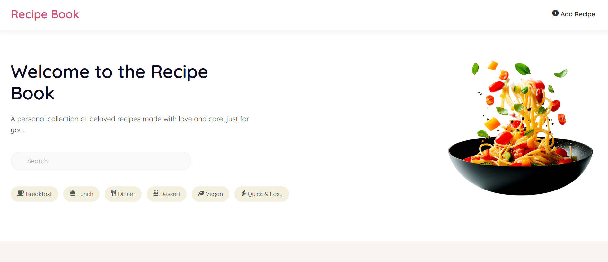
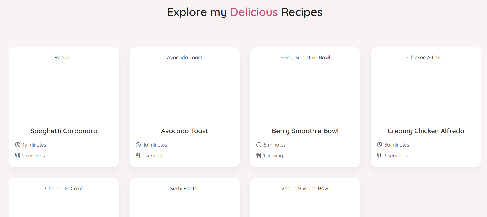
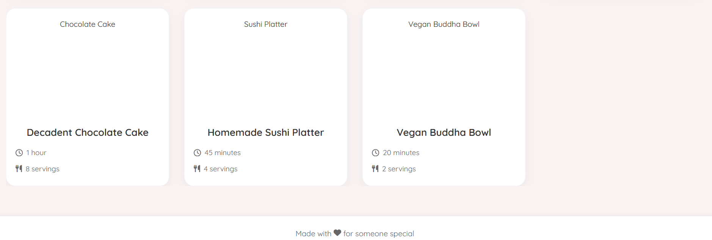

# Recipe Book Web Application

A modern, responsive web application for managing and browsing recipes. Built with a clean, user-friendly interface and robust backend functionality.





## Features

- 🍳 Browse and view recipes in a beautiful card layout
- 🔍 Search functionality for quick recipe finding
- 📱 Fully responsive design that works on all devices
- 🌙 Dark mode support
- 📋 Detailed recipe view with ingredients and instructions
- 🗂️ Category-based recipe organization
- ⚡ Fast and efficient SQLite database backend

## Tech Stack

- **Frontend:**
  - HTML5
  - CSS3 (with responsive design)
  - Vanilla JavaScript
  - Font Awesome icons
  - Google Fonts

- **Backend:**
  - Node.js
  - Express.js
  - SQLite3
  - RESTful API

## Installation

1. Clone the repository:

```bash
git clone https://github.com/yourusername/recipe-book.git
cd recipe-book
```

2. Install dependencies:

```bash
npm install
```

3. Start the server:

```bash
node server.js
```
4. Open your browser and navigate to:

```bash
http://localhost:3000
```


## Project Structure

fix the folder structure in the md, i want it to show nicely:
# Recipe Book Web Application

A modern, responsive web application for managing and browsing recipes. Built with a clean, user-friendly interface and robust backend functionality.


## Features

- 🍳 Browse and view recipes in a beautiful card layout
- 🔍 Search functionality for quick recipe finding
- 📱 Fully responsive design that works on all devices
- 🌙 Dark mode support
- 📋 Detailed recipe view with ingredients and instructions
- 🗂️ Category-based recipe organization
- ⚡ Fast and efficient SQLite database backend

## Tech Stack

- **Frontend:**
  - HTML5
  - CSS3 (with responsive design)
  - Vanilla JavaScript
  - Font Awesome icons
  - Google Fonts

- **Backend:**
  - Node.js
  - Express.js
  - SQLite3
  - RESTful API

## Installation

1. Clone the repository:

bash
git clone https://github.com/yourusername/recipe-book.git
cd recipe-book


2. Install dependencies:

bash
npm install


3. Start the server:

bash
node server.js


4. Open your browser and navigate to:

bash
http://localhost:3000


## Project Structure

recipe-book/
├── public/
│  ├── images/
│  ├── style.css
│  └── script.js
├── server.js
├── package.json
├── recipe.db
└── README.md


## API Endpoints

- GET /api/recipes - Fetch all recipes
- More endpoints coming soon...

## Contributing

Contributions are welcome! Please feel free to submit a Pull Request.

## License

This project is licensed under the MIT License - see the LICENSE file for details.

## Acknowledgments

- Font Awesome for the icons
- Google Fonts for the typography


## API Endpoints

- `GET /api/recipes` - Fetch all recipes
- More endpoints coming soon...

## Contributing

Contributions are welcome! Please feel free to submit a Pull Request.

## License

This project is licensed under the MIT License - see the LICENSE file for details.

## Acknowledgments

- Font Awesome for the icons
- Google Fonts for the typography
